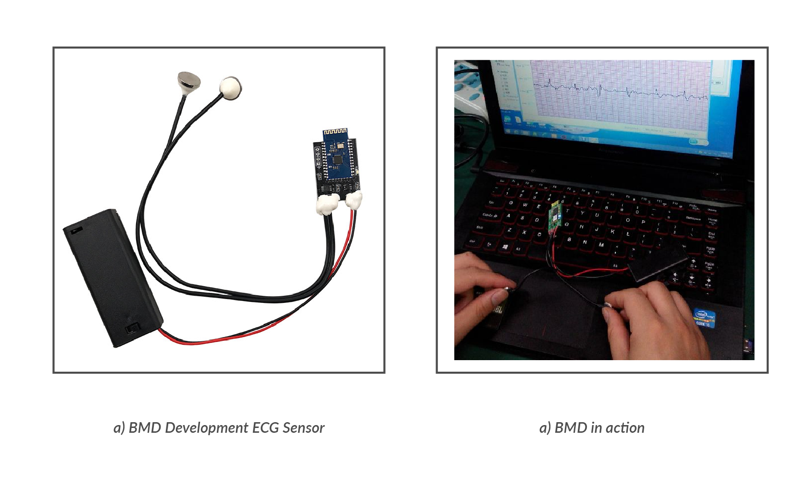
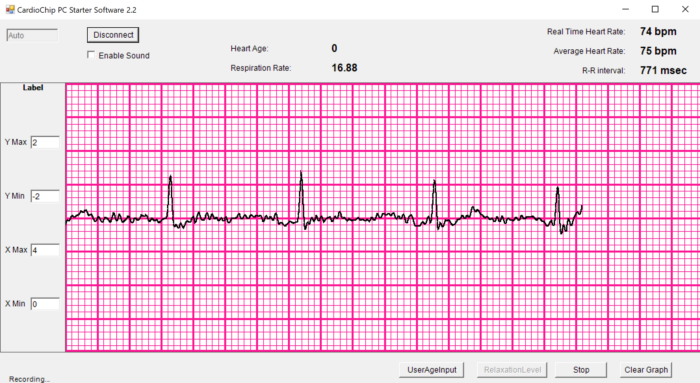

Get in touch on Twitter <a href="https://twitter.com/axelmukwena">@axelmukwena</a>

Be sure to checkout the <a href="https://github.com/axelmukwena/debbis-api">API</a> and <a href="https://github.com/axelmukwena/debbis">Ruby Web Client</a>

[](https://opensource.org/licenses/MIT)
[]()


Axel MS Mukwena | *Supervisor:* Prof Liming Zhang | Computer Science, Faculty of Science and Technology | University of Macau

# Documentation

### Deep ECG Based Biometric Identification System

The code to formulate Debbis is comprised of data processing and models development/training, API set up and client web application. Data processing development was on carried out on a **Macintosh 2.4 GHz Quad-Core Intel Core i7 16 GB RAM computer** and model developments were carried out on **Google Colab Premium running on a Tesla P100-PCIE-16GB GPU**.

## Data Processing and Models Development

Data processing was developmed in Python 3 and hosted under the directory **root_folder/biometricECG**, preferably performed using the Pycharm software by JetBrains under a virtual environment.

NB: For any **ModuleNotFoundError: No module named 'name'**, execute the following in the given directory
```
$ sudo python3 -m pip install 'name'
```
<figure>
  
  <figcaption>Figure 1: BMD101 Kit</figcaption>
</figure>


<figure>
  >
  <figcaption>Figure 2: BMD101 GUI Interface</figcaption>
</figure>


# Procedure:
NB: This experiments is optimized for the MIT-BIH Dataset

1. Getting the data:
    1. **MIT-BIH**
        1. Go to https://www.physionet.org/content/mitdb/1.0.0/ and download the zipped file. 
        1. Extract the files into the folder **root_folder/biometricECG/data/raw/mit/**
    1. **ECG-ID**
        1. Go to https://physionet.org/content/ecgiddb/1.0.0/ and download the zipped file. 
        1. Extract the files into the folder **root_folder/biometricECG/data/raw/ecgid/**
    1. **BMD101**
        1. Go to **root_folder/BMD101_Kit/windows/**, copy the folder contents into a folder on a windows operated device. 
        1. Connect the BMD101 Sensor Kit in Figure 1 to bluetooth on Windows-OS. 
        1. If requested for pin, enter '0000'. 
        1. After successfully connected, run the executable file **CardioChip.exe**. 
        1. After seeing the interface in Figure 2,  at the top, click 'Connect'
        1. After successfull connection, ecg signals will start to reflect on the interface. Click 'Record' at the bottom.
        1. Ensure minimal vibration in the surroundings.
        1. Optimal recording takes around 20-25 minutes
        1. When desired time is reached, click 'Stop', save the file in the desired location.
        1. In the desired location above, obtain the text files and copy them into **root_folder/biometricECG/data/raw/bmd101/raw/unique_id_folder/**
1. Once the data is fully set up, run the following commands in **root_folder/biometricECG/** to extract signals into readable **csv** file formats
    ```
    $ python3 run.py -s-mit
    $ python3 run.py -s-ecgid
    $ python3 run.py -s-bmd
    ```
1. For Feature Extraction, run. ECG segments of size 256 will be saved into the folder **root_folder/biometricECG/data/ready/signals/** in pickle format
    ```
    $ python3 run.py -f-mit
    $ python3 run.py -f-ecgid
    $ python3 run.py -f-bmd
    ```
1. Set up data for Training, Only MIT-BIH is selected. Two pickle files 'cnn.pickle' for CNN and 'snn.pickle' for SNN model development will be created in the folder **root_folder/biometricECG/data/ready/pickles/**
    ```
    $ python3 run.py -setup
    ```
1. Train the SNN model. A model will be saved in Keras `model.save()` format into the folder **root_folder/biometricECG/models/snn/** and all plots will be saved under **root_folder/biometricECG/media/plots/**
    ```
    $ python3 run.py -snn
    ```
1. Train the CNN model. A model will be saved in Keras `model.save()` format into the folder **root_folder/biometricECG/models/cnn/** and all plots will be saved under **root_folder/biometricECG/media/plots/**
    ```
    $ python3 run.py -cnn
    ```

# DEBBIS-API: Simulation API setup

The python API is available at https://github.com/axelmukwena/debbis-api

#### NB: Simulations only work with data created using the BMD101 Sensor
API setup was developmed in Python 3 and hosted under the directory **root_folder/debbis-api**. The API is developed using the Flask Framework to recieve HTTPS requests. The simulation utilizes the Siamese Neural Network Model since the SNN model completes all the requirements for Debbis. 

After installation of all required packages and modules, obtain and copy the 'contents' of the SNN model titled **debbis** saved in **biometricECG/models/snn/debbis/** and paste into **debbis-api/model/**.

File structure should resemble or similar:
- debbis-api
        - model
            - assets
            - variables
            - keras_metadata.pb
            - saved_model.pb

After setup, run
```
$ python3 app.py
```

which should start up the development server at the following url  http://127.0.0.1:5000/ 

# DEBBIS: Simulation, Client Web App

The framework is available at https://github.com/axelmukwena/debbis

The client web app is developed using the Ruby on Rails Framework and hosted under the directory **root_folder/debbis** .The RubyMine IDE by JetBrains is prefered. `ruby '3.0.0'` and `rails '~> 6.1.3'` should be installed.

Install the needed gems (while skipping any gems needed only in production):

```
$ bundle install --without production
```
Install JavaScript dependencies:
```
$ yarn install
```
Next, migrate the database:

```
$ rails db:migrate
```
Run the app in a local server:

```
$ rails server
```

The server should start and the app should be accessible at http://localhost:3000/

1. Once both the API and Web Client servers are operational, a Super User needs to create an account at http://localhost:3000/signup. 
1. Once signed up and logged in, go to enroll, http://localhost:3000/members/new and add a new member to the system.
    1. Identity is a Unique integer ID key, 
    1. Node should be set to 0
    1. Name, Age, Gender are optional
1. Once a member is enrolled, you will be redirected to the Members page, where you can upload the text file title starting **ECGLog...** obtained from the BMD101 Sensor. After submiting templates, the data will be sent to the Python API and the most representative ECG segments of that individual will be selected and saved.
1. Once templates are successfully saved, any enrolled member can use the home page, http://localhost:3000/, upload a new text file title starting **ECGLog...** obtained from the BMD101 Sensor, submit by clicking access and if such member is enrolled, they will be taken to an only-member accessible page.
