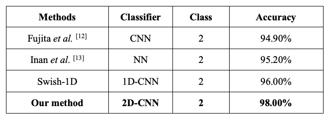

# Biometric ECG
---
##### 01 Nov, 2020
An ECG based biometric model for specialised authentication systems
- Confusion matrix [[1][1]]
- PhysioNet Tutorials [[2][2]] | Just dicovered this dataset: http://thew-project.org/database/e-hol-03-0202-003.html
- How to exctract ECG Features [[3][3]]
- ECG **R-peak segmentation** algorithm, Christov Segmenter [[4][4]] and [[5][5]]
- A Comparison of 1-D and 2-D Deep Convolutional Neural Networks
in ECG Classification [[6][6]]
    - 
- Convert ECG signal to a 2D image. However, there are certain **drawbacks and limitations** of using such deep CNNs. [[7][7]]
    - To start with it is known that they pose a **high computational complexity** that requires special hardware especially for training. 
    - Hence, 2D CNNs are **not suitable for real-time applications** on mobile and low-power/low-memory devices.
	- Moreover, proper training of deep CNNs **requires a very large training dataset** in order to achieve a reasonable generalization capability. 
	- This may not be a viable option for many practical 1D signal applications where the labeled data is scarce.
-   2D time-frequency spectrograms using short-time Fourier transform (STFT)?
- Apply cropping??
- Do I select equal number ecg record files per person?
- Image size?? https://arxiv.org/abs/2005.06902

### Notable sources & Readings
1. https://github.com/hiredd/DeepECG-1
1. https://github.com/SoufianeDataFan/ECG-authentificate
1. https://leejunhyun.github.io/project/biomedical/2018/09/25/ECG-biometrics/
1. https://github.com/ankur219/ECG-Arrhythmia-classification
	1. https://medium.com/datadriveninvestor/ecg-arrhythmia-classification-using-a-2-d-convolutional-neural-network-33aa586bad67
	2. https://arxiv.org/pdf/1804.06812.pdf
1. https://github.com/lorenzobrusco/ECGNeuralNetwork
1. Great source for fourier transformations:  https://github.com/gogowenzhang/ECG_Detector 

---
##### 18 Nov, 2020

1. Quality > Quantity of data: https://news.voyage.auto/active-learning-and-why-not-all-data-is-created-equal-8a43a758c6f9
1. Imbalance in datasets: https://towardsdatascience.com/handling-imbalanced-datasets-in-machine-learning-7a0e84220f28
    - https://towardsdatascience.com/deep-learning-unbalanced-training-data-solve-it-like-this-6c528e9efea6
    - When out of all the classes which you want to predict if for one or more classes there are extremely low number of samples you may be facing a problem of unbalanced classes in your data.
1. Transforming an inertial sensor signal into images with large dimensions will allow a CNN to infer many correlations among dimensions, allowing it to extract detailed features and rich information from the original signal.
    - https://www.ncbi.nlm.nih.gov/pmc/articles/PMC6263516/

---
##### 18 Dec, 2020
1. How to augment signal images for cnn https://link.springer.com/chapter/10.1007/978-3-319-73600-6_8
1. What is the [minimum sample size](https://www.researchgate.net/post/What_is_the_minimum_sample_size_required_to_train_a_Deep_Learning_model-CNN) required to train a Deep Learning model - CNN?
1. Why it's necessary to have [equal classes](https://www.cs.cmu.edu/afs/cs/project/jair/pub/volume16/chawla02a-html/chawla2002.html)
1. How to [augment sound](https://medium.com/@keur.plkar/audio-data-augmentation-in-python-a91600613e47) + [code](https://gist.github.com/keyurparalkar/5a49f696ed36ddce6526ab50e29e04ce)

---
##### 29 Dec, 2020
1. Setup Dataset [scikit-learn tutorial](https://kapernikov.com/tutorial-image-classification-with-scikit-learn/)
1. Setup and [Keras generator](https://machinelearningmastery.com/how-to-load-large-datasets-from-directories-for-deep-learning-with-keras/)
1. How to divide data for training, validation and testing [here](https://glassboxmedicine.com/2019/09/15/best-use-of-train-val-test-splits-with-tips-for-medical-data/)

##### 02 Jan, 2021
1. [How][8] to add a new class to a deep learning model?
1. [Discussion][9] on incremental learning for the model?? Check [this][10] paper
1. https://ieeexplore.ieee.org/document/9032813
1. https://run.unl.pt/bitstream/10362/75491/1/Bento_2019.pdf

##### 17 March, 2021
1. [Building][11] CNN with Keras
1. [Incremental Learning][12] with Keras using linear regression on CNN pre-trained model
1. Very Deep Convolutional Networks for Large-Scale Image Recognition [VGG paper][13]
1. [REST API][14]
1. [Something][15] to read about on transfer learning
1. How to fine-tune a keras model with existing plus newer classes? [Not yet possible?][16]
1. [How to actually implement...][17] Transfer Learning in Keras with Computer Vision Models [github example][18]
1. [categorical_crossentropy vs sparse_categorical_crossentropy][19]
1. [How to][20] predict samples 
1. Different NN architecture implementations [Github][21], [MachineLearningMastery][22], [Medium][23]
1. Why use [BatchNormalization][24], also [ordering][25]
1. [RecuPlots and CNNs for time-series classification][26]
1. [Cancelling Harmonic Power Line Interference in Biopotentials][27]
1. [Classification of Time-Series Images Using Deep Convolutional Neural Networks][28]
1. [How to Convert an RGB Image to Grayscale][29]

##### 21 April, 2021
1. Build Deep Learning [REST API][30]
1. How to Use cURL to Test a Rails API [Medium][31]
1. Why have extra classes with data you don't want to classify [forums fast.ai][32]
1. Image memory management [stackoverflow][33]
1. Decode encode images [stackoverflow][34], [python docs][35]
1. Conv2D vs Conv1D [stackexchange][36]
1. Why choose images over pure signals. Because pure signals of ECG waves have different shapes
1. Finding windows IP and Hostname Details: 
   - CMD: ipconfig/all

##### 12 May, 2021
1. Data acquisition, 6 min 46 seconds, ID: 5000 
1. Smoothen signal from BMD [stackoverflow][37]
1. High training acc low validation acc [data science stackexchange][38]
1. Simulate ECG [NeuroKit][39]
1. Fluctuating accuracy [here][40]
1. Ear Biometric Classification [Medium][41]
1. Biometric identification based on Transient Evoked Otoacoustic Emission [IEEE][42]
1. Recording 6000 beats takes about 20 min
1. Open-set recognition papers [Dr Walter][43]
1. Features have different sizes. And people have different sizes of PQRS
1. BMD101 Sampling Rate 512Hz
1. 1D convolutions explained [here][45]
1. Filters again [here][46]
1. Feature extraction of ECG signal [tandfonline][47]
1. DEVELOPING A MACHINE LEARNING FRAMEWORK FOR 24-HOUR DATA ANALYSIS AIMED 
   AT EARLY DETECTION OF CARDIAC ARRHYTHMIAS AS A GUIDING TOOL FOR PHYSICIANS [Thesi paper][48]
1. Time series of varying sizes [paper][49]   
1. Person 213 too low, 214 kinda good, 121 kinda high, 112 & 117 unstable, check 109 first
1. Only the loss function is used to update your model's parameters, the accuracy is only used for you to see how well your model is doing.
1. Why is validation loss lower than training loss [pyimagesearch][50]
1. 7, preferable N filter factor for BMD signals
1. ECG QRS detectors [github][51]

#### Images: Testing different dataset sizes
1. 1000 images per class, 10 epochs, 8 bs
    - training acc: 0.9985
    - val acc:      0.3524
1. 2000 images per class, 10 epochs, 16 bs 
    - training acc: 0.9991
    - Val acc:      0.7587
    - test acc:     0.7357
    - Detecting images not part of classes terrible
1. 2000 images per class, 10 epochs, 32 bs 
    - training acc: 1.0000
    - Val acc:      0.9979
    - test acc:     0.9952
    - Detecting images not part of classes kinda good
1. 2000 images per class, 5 epochs, 8 bs 
    - training acc: 0.9979
    - Val acc:      0.9979
    - test acc:     1.0000
    - Detecting images not part of classes not good
1. 3000 images per class, 10 epochs, 32 bs 
    - training acc: 0.9996
    - Val acc:      0.9988
    - test acc:     0.9952
    - Detecting images not part of classes not good
1. 4000 images per class, 10 epochs, 64 bs 
    - training acc: 0.9996
    - Val acc:      0.9984
    - test acc:     1.0000
    - Detecting images not part of classes not good
   
#### Signals 1D: Testing different dataset sizes
1. Auth MIT
   - 4640-per-class time-series signals of length 700
   - 204160 total, 44 classes
   - 70, 20, 10 split
   - 56 epochs, 100 bs, learning rate 0.00001, decay = LR/EPOCHS
   - training acc: 0.9992
   - val acc: 0.9976
   - test acc: 0.9975
   - known vs unknown margin 0.99
   - margin known test 20416: 19954/462
   - margin unknown blind 18560: 1170/17390
   - 91.35243798494339 minutes
   
1. Auth 3 ECGID
   - 250 per class time series of length 512
   - 9777 total, 40 classes
   - 60, 20, 20 split
   - 41 epochs, 16 BS, lr 0.00001
   - training acc: 1
   - val acc: 1
   - test acc: 1
   - val loss: 0.0021
   - test margin for 0.99: 1915/15
   - 8.876168596744538 min
   
1. Auth 5 MIT
   - 5000 per class time series of length 256
   - 200000 total, 40 classes
   - 60, 20, 20 split
   - 22 epochs, 256 BS, lr 0.00001
   - training acc: 0.9995
   - val acc: 0.9936
   - test acc: 0.9935
   - val loss: 0.0237
   - test margin for 0.99: 38019/1755
   - 12.824102409680684 min
    

[1]: <https://www.dataschool.io/simple-guide-to-confusion-matrix-terminology/#:~:text=A%20confusion%20matrix%20is%20a,related%20terminology%20can%20be%20confusing.>
[2]: <https://archive.physionet.org/tutorials/creating-records.shtml>
[3]: <https://ieeexplore.ieee.org/document/6950168>
[4]: <https://biosppy.readthedocs.io/en/stable/biosppy.signals.html>
[5]: <https://www.semanticscholar.org/paper/Review-and-Comparison-of-Real-Time-Segmentation-for-Canento-Louren%C3%A7o/788a62ac3567e7793cfdf14aae65296101c43042>
[6]: <https://arxiv.org/pdf/1810.07088.pdf>
[7]: <https://ieeexplore.ieee.org/document/8682194>
[8]: <https://datascience.stackexchange.com/questions/15656/how-to-add-a-new-category-to-a-deep-learning-model/57189#57189>
[9]: <https://www.researchgate.net/post/What-are-the-techniques-for-incremental-training-of-Convolutional-Neural-Networks-without-doing-full-training-as-new-classes-are-added-to-data>
[10]: <https://arxiv.org/abs/1807.09536>
[11]: <https://www.pyimagesearch.com/2018/04/16/keras-and-convolutional-neural-networks-cnns/>
[12]: <https://www.pyimagesearch.com/2019/05/20/transfer-learning-with-keras-and-deep-learning/>
[13]: <https://arxiv.org/abs/1409.1556>
[14]: <https://blog.keras.io/building-a-simple-keras-deep-learning-rest-api.html>
[15]: <https://towardsdatascience.com/transfer-learning-from-pre-trained-models-f2393f124751>
[16]: <https://stackoverflow.com/questions/58027839/how-to-fine-tune-a-keras-model-with-existing-plus-newer-classes>
[17]: <https://machinelearningmastery.com/how-to-use-transfer-learning-when-developing-convolutional-neural-network-models/>
[18]: <https://github.com/anujshah1003/Transfer-Learning-in-keras---custom-data/blob/master/transfer_learning_resnet50_custom_data.py>
[19]: <https://datascience.stackexchange.com/questions/41921/sparse-categorical-crossentropy-vs-categorical-crossentropy-keras-accuracy>
[20]: <https://www.machinecurve.com/index.php/2020/02/21/how-to-predict-new-samples-with-your-keras-model/>
[21]: <https://github.com/nickbiso/Keras-Caltech-256>
[22]: <https://machinelearningmastery.com/how-to-implement-major-architecture-innovations-for-convolutional-neural-networks/>
[23]: <https://medium.com/pythoneers/vgg-16-architecture-implementation-and-practical-use-e0fef1d14557>
[24]: <https://machinelearningmastery.com/how-to-accelerate-learning-of-deep-neural-networks-with-batch-normalization/>
[25]: <https://stackoverflow.com/questions/39691902/ordering-of-batch-normalization-and-dropout/40295999#40295999>
[26]: <https://www.kaggle.com/tigurius/recuplots-and-cnns-for-time-series-classification>
[27]: <https://www.intechopen.com/books/compendium-of-new-techniques-in-harmonic-analysis/cancelling-harmonic-power-line-interference-in-biopotentials>
[28]: <https://arxiv.org/pdf/1710.00886.pdf>
[29]: <https://e2eml.school/convert_rgb_to_grayscale.html>
[30]: <https://blog.keras.io/building-a-simple-keras-deep-learning-rest-api.html>
[31]: <https://medium.com/@ConnorFinnegan/how-to-use-curl-to-test-a-rails-api-55fd2c43c999>
[32]: <https://forums.fast.ai/t/handle-data-that-belongs-to-classes-not-seen-in-training-or-testing/55781/4>
[33]: <https://stackoverflow.com/questions/55472656/how-can-i-load-a-image-in-python-but-keep-it-compressed>
[34]: <https://stackoverflow.com/questions/64405395/how-to-deal-with-typeerror-object-of-type-bytes-is-not-json-serializable>
[35]: <https://docs.python.org/3/library/base64.html>
[36]: <https://stats.stackexchange.com/questions/295397/what-is-the-difference-between-conv1d-and-conv2d>
[37]: <https://stackoverflow.com/questions/37598986/reducing-noise-on-data>
[38]: <https://datascience.stackexchange.com/questions/29893/high-model-accuracy-vs-very-low-validation-accuarcy>
[39]: <https://dominiquemakowski.github.io/post/simulate_ecg/>
[40]: <https://stats.stackexchange.com/questions/255105/why-is-the-validation-accuracy-fluctuating>
[41]: <https://medium.com/haydenliu-ml/biometric-classification-4b5a67ab8882>
[42]: <https://ieeexplore.ieee.org/abstract/document/6781891>
[43]: <https://www.wjscheirer.com/projects/openset-recognition/>
[45]: <https://www.cs.cornell.edu/courses/cs1114/2013sp/sections/S06_convolution.pdf>
[46]: <https://machinelearningmastery.com/introduction-to-1x1-convolutions-to-reduce-the-complexity-of-convolutional-neural-networks/>
[47]: <https://www.tandfonline.com/doi/full/10.1080/03091902.2018.1492039>
[48]: <http://summit.sfu.ca/system/files/iritems1/19730/etd20310.pdf>
[49]: <https://www.researchgate.net/publication/336411021_Time_series_classification_for_varying_length_series>
[50]: <https://www.pyimagesearch.com/2019/10/14/why-is-my-validation-loss-lower-than-my-training-loss/>
[51]: <https://github.com/berndporr/py-ecg-detectors>
